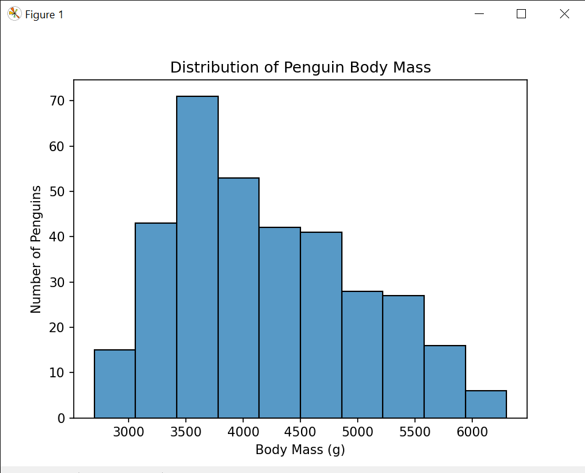

# Palmer Penguins Data Visualization

## Project Overview

This project uses Python to visualize the Palmer Penguins dataset. 
The purpose of the project is to practice data visualization using 
Matplotlib and Seaborn.

The dataset contains information about different penguin species, 
including their bill measurements, flipper length, body mass, island, 
and sex.

## Dataset

The dataset used in this project is the Palmer Penguins dataset.

The dataset was obtained as a publicly available CSV file and is 
included in this project as `penguins.csv`.

## Tools and Libraries

- Python
- Pandas
- Matplotlib
- Seaborn

## Visualizations

This project contains four visualizations:
### 1. Line Plot

A line plot was created using Matplotlib to show the body mass of the first 20 penguins.

### 2. Scatter Plot

A scatter plot was created using Matplotlib to visualize the relationship between flipper length and body mass.

### 3. Histogram

A histogram was created using Seaborn to show the distribution of penguin body mass.

### 4. Box Plot

A box plot was created using Seaborn to compare the body mass of different penguin species.

Author:
Alabegbe Shaneil Esohe
